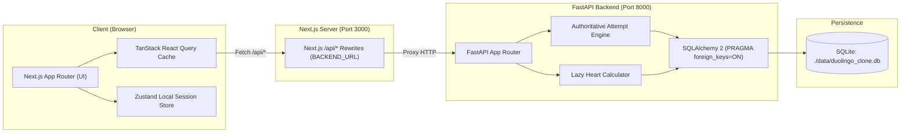

# System Architecture

## 1. Monorepo Organization

```
DuoLingoClone/
├── frontend/             # Next.js App Router, TypeScript, Tailwind, Zustand, TanStack Query
├── backend/              # Python 3.12+, FastAPI, SQLAlchemy 2, Pydantic v2, SQLite
├── docs/                 # Architecture, API, Schema, and Design documentation
│   ├── SCHEMA.md
│   ├── API.md
│   ├── DESIGN.md
│   └── ARCHITECTURE.md
├── data/                 # Local SQLite database directory (runtime created, gitignored)
│   └── duolingo_clone.db
└── README.md             # Developer getting started, scripts, and environment docs
```

---

## 2. System Architecture & Request Flow



---

## 3. Core Architectural Principles

### 3.1 Authoritative Server Session Model
- Client devices cannot be trusted with answer keys, hearts arithmetic, or XP distribution.
- `exercises.answer_json` is strictly kept on the server and omitted from lesson manifests.
- Submissions (`POST /api/attempts/{attempt_id}/check`) check answers server-side, maintain attempt logs in `attempt_answers`, and manage heart balance changes.
- Completion (`POST /api/attempts/{attempt_id}/complete`) accepts an empty body and authoritatively computes final accuracy and XP based on recorded answers.

### 3.2 Single Logical Clock
- All server business logic derives "now" via:
  $$\text{logical\_now} = \text{datetime.now(timezone.utc)} + \text{timedelta(days=user.date\_offset\_days)}$$
- Streak calculations and daily activity aggregation reference `logical_now` localized to the user's configured timezone.
- Debug endpoints allow incrementing `date_offset_days` to simulate advancing time without altering host clocks.

### 3.3 Lazy Heart Regeneration & Critical Invariant
- Maximum heart capacity is 5.
- Regeneration rate: $+1$ heart per 5 hours (18,000 seconds).
- Rather than running heavy periodic background workers, regeneration is computed lazily whenever user state or attempts are queried:
  $$\text{elapsed} = \text{logical\_now} - \text{user.hearts\_updated\_at}$$
  $$\text{hearts\_to\_add} = \lfloor \text{elapsed} / 18000 \rfloor$$
- **Critical Rule**: When a user at 5 hearts loses a heart, `hearts_updated_at` MUST be updated to `logical_now` **BEFORE** decrementing `hearts` to 4. This guarantees the 5-hour regeneration timer for heart #5 starts precisely at the moment of failure.

### 3.4 API Type Synchronization via `openapi-typescript`
- The FastAPI application generates `/openapi.json`.
- The frontend uses `openapi-typescript` to generate strict TypeScript declarations (`src/lib/api/schema.d.ts`).
- Hand-written duplicated API interfaces are disallowed; all client responses and request parameters bind directly to OpenAPI components.

---

## 4. Phase 1.5 Database Architecture & Railway Deployment

### 4.1 Environments & Stack Definition

- **Local Development**:
  $$\text{Next.js (Port 3000)} \longrightarrow \text{FastAPI (Port 8000)} \longrightarrow \text{SQLite (./data/duolingo_clone.db)}$$
  - `DATABASE_URL`: `sqlite:///./data/duolingo_clone.db`
  - Connection pragma: `PRAGMA foreign_keys = ON;` enforced on every connection.
  - Runtime database directory `./data` created automatically at startup.

- **Production Deployment**:
  $$\text{Vercel (Next.js Frontend)} \longrightarrow \text{Railway (FastAPI Service)} \longrightarrow \text{SQLite (./data/duolingo_clone.db)}$$
  - `DATABASE_URL`: `sqlite:///./data/duolingo_clone.db`
  - Host: Railway Web Service running Python 3.12.8 via Nixpacks (`railway.json` / `backend/Procfile`).
  - Database: Authoritative SQLite database file at `./data/duolingo_clone.db`.
  - Pure SQLite database layer across local and deployed environments.

### 4.2 Seed & Lifespan Behavior
- On startup, the FastAPI lifespan executes `ensure_data_directory()`, `init_db()` (creates all 13 locked tables), and `seed_database()`.
- Seeding is deterministic and idempotent:
  - Upserts course, 3 units, 9 skills, 27 lessons, 216 exercises, 8 achievements, and 15 leaderboard bots.
  - Default learner (User 1) progress is preserved and never overwritten across subsequent seed runs.

### 4.3 Railway SQLite Persistence Limitation
- Standard Railway containers run on an ephemeral filesystem. Unless an external Railway persistent volume is mounted at `./data`, application redeployments, restarts, or container sleep cycles reset `./data/duolingo_clone.db`.
- On cold boot, the deterministic idempotent seed restores the baseline curriculum and User 1 baseline.
- Production persistence on Railway is NOT claimed as proven at this gate. Phase 1.5 persistence is NOT complete.
