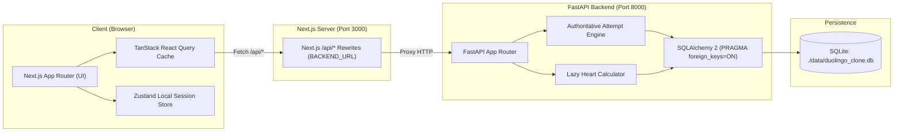

# System Architecture

## 1. Monorepo Organization

```
DuoLingoClone/
├── frontend/             # Next.js App Router, TypeScript, Tailwind, Zustand, TanStack Query
├── backend/              # Python 3.12+, FastAPI, SQLAlchemy 2, Pydantic v2, SQLite
├── docs/                 # Architecture, API, Schema, and Design documentation
│   ├── SCHEMA.md
│   ├── API.md
│   ├── DESIGN.md
│   └── ARCHITECTURE.md
├── data/                 # Local SQLite database directory (runtime created, gitignored)
│   └── duolingo_clone.db
└── README.md             # Developer getting started, scripts, and environment docs
```

---

## 2. System Architecture & Request Flow



---

## 3. Core Architectural Principles

### 3.1 Authoritative Server Session Model
- Client devices cannot be trusted with answer keys, hearts arithmetic, or XP distribution.
- `exercises.answer_json` is strictly kept on the server and omitted from lesson manifests.
- Submissions (`POST /api/attempts/{attempt_id}/check`) check answers server-side, maintain attempt logs in `attempt_answers`, and manage heart balance changes.
- Completion (`POST /api/attempts/{attempt_id}/complete`) accepts an empty body and authoritatively computes final accuracy and XP based on recorded answers.

### 3.2 Single Logical Clock
- All server business logic derives "now" via:
  $$\text{logical\_now} = \text{datetime.now(timezone.utc)} + \text{timedelta(days=user.date\_offset\_days)}$$
- Streak calculations and daily activity aggregation reference `logical_now` localized to the user's configured timezone.
- Debug endpoints allow incrementing `date_offset_days` to simulate advancing time without altering host clocks.

### 3.3 Lazy Heart Regeneration & Critical Invariant
- Maximum heart capacity is 5.
- Regeneration rate: $+1$ heart per 5 hours (18,000 seconds).
- Rather than running heavy periodic background workers, regeneration is computed lazily whenever user state or attempts are queried:
  $$\text{elapsed} = \text{logical\_now} - \text{user.hearts\_updated\_at}$$
  $$\text{hearts\_to\_add} = \lfloor \text{elapsed} / 18000 \rfloor$$
- **Critical Rule**: When a user at 5 hearts loses a heart, `hearts_updated_at` MUST be updated to `logical_now` **BEFORE** decrementing `hearts` to 4. This guarantees the 5-hour regeneration timer for heart #5 starts precisely at the moment of failure.

### 3.4 API Type Synchronization via `openapi-typescript`
- The FastAPI application generates `/openapi.json`.
- The frontend uses `openapi-typescript` to generate strict TypeScript declarations (`src/lib/api/schema.d.ts`).
- Hand-written duplicated API interfaces are disallowed; all client responses and request parameters bind directly to OpenAPI components.

---

## 4. Phase 1.5 Persistence Decision Gate (Final Decision)

- **Local Database**: Plain SQLite file at `./data/duolingo_clone.db` with `PRAGMA foreign_keys = ON;`.
- **Production Database**: SQLite at `./data/duolingo_clone.db` on Render.
- **Evaluation Outcome & Spike Analysis**:
  - *Turso / libSQL Spike*: Evaluated `sqlalchemy-libsql` (v0.2.0) and `libsql-experimental`. The client driver failed native compilation/linking on modern Python environments and exhibits known dialect friction with SQLAlchemy 2 (specifically SQLite partial unique index filtering `sqlite_where`). To maintain architecture stability and avoid fragile proprietary drivers, Turso/libSQL was rejected.
  - *Render SQLite Restart Behavior*: Tested with a real lesson attempt in `lesson_attempts`. Process-level restarts on persistent filesystems cleanly preserve all tables, rows, and idempotent seed state. However, on the Render Free tier, the filesystem is ephemeral: container spin-down or rebuilds reset `./data` back to fresh deployment state.
  - *Idempotent Seed Resilience*: On every cold start or container reset, the FastAPI startup lifespan deterministically executes `init_db()` and `seed_database()`, recreating the complete 13-table schema, 216 curriculum exercises, 8 achievements, 15 leaderboard bots, and User 1 baseline progress.
  - *Final Decision*: **Ship Render SQLite as the production database**.
- **Required Environment Variables**:
  - `DATABASE_URL`: `sqlite:///./data/duolingo_clone.db`
  - `PYTHON_VERSION`: `3.12.8`
  - `PORT`: Provided dynamically by Render (defaults to `8000`)
  - `ENABLE_DEBUG`: `true`
- **Known Free-Tier Limitation**: On the free tier of Render, learner state created during an active container session resets if Render terminates the idle container. For persistent multi-month persistence on Render without reset, a persistent disk add-on ($0.25/GB/mo on Starter tier) would be required. Local development strictly uses plain SQLite without reset.
