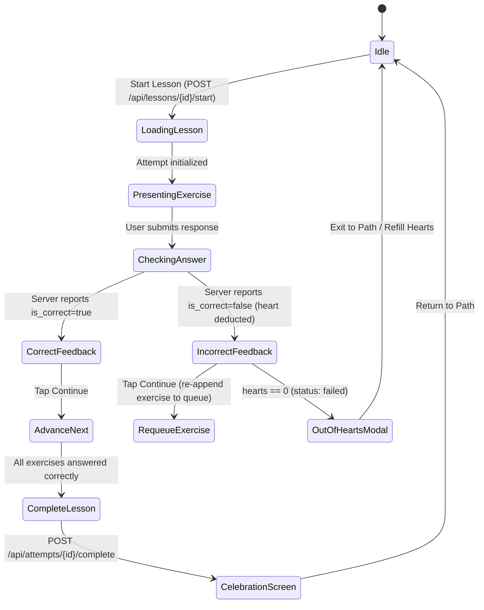

# Frontend Design & UI/UX Specification

## 1. Design Language & Tokens

### 1.1 Typography
- **Primary Font**: `Nunito` (Google Fonts, loaded via `next/font/google` with weights 400, 600, 700, 800, 900).
- **Body Text**: Font weight 600 or 700 for high legibility, playful rounded curves characteristic of Duolingo.
- **Headings**: Extra-bold (800) or Black (900).

### 1.2 Color Palette (Duolingo Aesthetic)
- **Primary / Brand Green**:
  - `duo-green`: `#58cc02`
  - `duo-green-dark`: `#46a302` (3D bottom border / shadow)
  - `duo-green-light`: `#89e219`
- **Hearts / Coral Red**:
  - `duo-red`: `#ff4b4b`
  - `duo-red-dark`: `#ea2b2b`
  - `duo-red-light`: `#ff7878`
- **Gems / Cyan Blue**:
  - `duo-blue`: `#1cb0f6`
  - `duo-blue-dark`: `#1899d6`
- **Streaks / Amber Orange**:
  - `duo-orange`: `#ff9600`
  - `duo-orange-dark`: `#e08500`
- **Neutrals / Slate**:
  - `duo-gray-100`: `#f7f7f7`
  - `duo-gray-200`: `#e5e5e5`
  - `duo-gray-300`: `#afafaf`
  - `duo-gray-700`: `#4b4b4b`
  - `duo-gray-900`: `#1f1f1f`

### 1.3 Tactile 3D Buttons & Cards
- Every interactive button and option card uses the signature 3D bottom bevel (`border-b-4` or layered shadows).
- On active click (`:active`), the button translates down by 2-4px and flattens the bottom border (`border-b-0` or `translate-y-1`), producing the tactile mechanical key feel.

---

## 2. Component Architecture & State Management

### 2.1 State Strategy: TanStack Query + Zustand
- **TanStack React Query**:
  - Server state caching, background refetching, and cache invalidation.
  - Queries: `['user']`, `['course', courseId, 'path']`, `['lesson', lessonId]`, `['leaderboard']`, `['achievements']`.
  - Mutations: `useStartAttempt`, `useCheckAnswer`, `useCompleteAttempt`, `useRefillHearts`.
  - Automatic cache invalidation upon completion or heart refill.
- **Zustand Stores**:
  - `useSessionStore`: Tracks local lesson queue, active question index, selected response state, audio settings.
  - `useUIStore`: Manages global modals (Refill Hearts modal, Quit Lesson confirmation, Settings drawer).

### 2.2 Lesson Session State Machine

### 2.3 Exercise Types
The frontend handles 5 locked exercise types:
1. `multiple_choice`: Radio-style selection with options and distractors.
2. `translate`: Word-bank tile assembler or free translation.
3. `match_pairs`: Dual-column vocabulary tap-to-match with instant pairing animations.
4. `fill_blank`: Sentence with inline dropdown or missing word tile selection.
5. `type_answer`: Text input with character limits and autofocus.

---

## 3. Motion & Micro-Interactions (Framer Motion)

- **Exercise Transitions**: Slide-in from right (`x: 40`, `opacity: 0`) and exit to left on advance.
- **Progress Bar**: Spring-animated width transition (`stiffness: 300, damping: 30`) reflecting proportion of completed exercises.
- **Footer Feedback Drawer**:
  - Correct: Slide up green banner with celebration icon, bouncy checkmark.
  - Incorrect: Slide up red banner with correct answer reveal and shake animation.
- **Heart Loss Effect**: Floating `-1` icon floating upwards and fading out from the top heart widget.
- **Completion Fanfare**: Lottie or Framer Motion celebration with XP counter increment animation.
